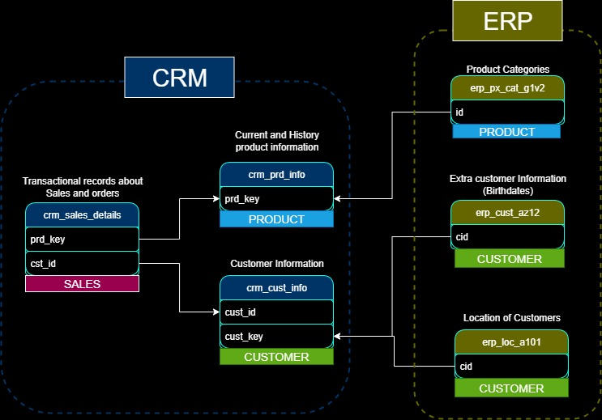

# SQL Data Warehouse Project

A modern 3-layer data warehouse implementation using SQL Server, following the Bronze-Silver-Gold (medallion) architecture pattern. This project demonstrates ETL processes, data quality checks, and dimensional modeling for analytics and reporting.

## 📊 Architecture Overview

This data warehouse follows the **medallion architecture** with three distinct layers:

- **🥉 Bronze Layer**: Raw data ingestion from source systems
- **🥈 Silver Layer**: Cleaned and transformed data with business logic applied
- **🥇 Gold Layer**: Aggregated, business-ready data optimized for analytics



## 🏗️ Project Structure

```
sql-warehouse/
├── datasets/
│   ├── source_crm/          # CRM system data files
│   │   ├── cust_info.csv
│   │   ├── prd_info.csv
│   │   └── sales_details.csv
│   └── source_erp/          # ERP system data files
│       ├── CUST_AZ12.csv
│       ├── LOC_A101.csv
│       └── PX_CAT_G1V2.csv
├── scripts/
│   ├── init_database.sql    # Database and schema initialization
│   ├── bronze/              # Bronze layer scripts
│   │   ├── ddl_bronze.sql
│   │   └── proc_load_bronze.sql
│   ├── silver/              # Silver layer scripts
│   │   ├── ddl_silver.sql
│   │   └── proc_load_silver.sql
│   └── gold/                # Gold layer scripts
│       └── ddl_gold.sql
├── tests/                   # Data quality validation scripts
│   ├── quality_checks_silver.sql
│   └── quality_checks_gold.sql
├── docs/
│   └── dataintegration.jpg  # Architecture diagram
└── README.md
```

## 🗄️ Data Sources

### CRM System
- **Customer Information**: Demographics and account details
- **Product Information**: Product catalog with pricing and categories
- **Sales Details**: Transaction records with order information

### ERP System
- **Customer Demographics**: Extended customer data (birthdate, gender)
- **Location Data**: Customer geographic information
- **Product Categories**: Product classification and maintenance data

## 🔄 ETL Pipeline

### 1. Bronze Layer (Data Ingestion)
- Direct ingestion from CSV files using `BULK INSERT`
- Minimal transformation, preserving source data structure
- Tables: `bronze.crm_*` and `bronze.erp_*`

### 2. Silver Layer (Data Cleansing & Transformation)
- Data standardization and normalization
- Business logic application
- Data quality improvements:
  - Duplicate removal
  - Null value handling
  - Date format standardization
  - Value mapping (codes to descriptions)

### 3. Gold Layer (Analytics-Ready Data)
- Star schema implementation with:
  - **Dimension Tables**: `dim_customers`, `dim_products`
  - **Fact Tables**: `fact_sales`
- Optimized for reporting and analytics
- Views combining data from multiple silver tables

## 🚀 Getting Started

### Prerequisites
- SQL Server (2016 or later)
- SQL Server Management Studio (SSMS) or Azure Data Studio
- Appropriate file system permissions for BULK INSERT operations

### Installation & Setup

1. **Clone the repository**
   ```bash
   git clone <repository-url>
   cd sql-warehouse
   ```

2. **Initialize the database**
   ```sql
   -- Run in SQL Server Management Studio
   :r scripts/init_database.sql
   ```

3. **Create Bronze layer tables**
   ```sql
   :r scripts/bronze/ddl_bronze.sql
   ```

4. **Create Silver layer tables**
   ```sql
   :r scripts/silver/ddl_silver.sql
   ```

5. **Create Gold layer views**
   ```sql
   :r scripts/gold/ddl_gold.sql
   ```

### Data Loading Process

1. **Load Bronze layer**
   ```sql
   EXEC bronze.load_bronze;
   ```

2. **Load Silver layer**
   ```sql
   EXEC silver.load_silver;
   ```

3. **Query Gold layer** (Views are automatically populated)
   ```sql
   SELECT * FROM gold.dim_customers;
   SELECT * FROM gold.dim_products;
   SELECT * FROM gold.fact_sales;
   ```

## 📋 Data Quality & Testing

The project includes comprehensive data quality checks:

### Silver Layer Quality Checks
- Primary key integrity validation
- Data standardization verification
- Date range and order validation
- Business rule consistency checks

### Running Quality Checks
```sql
-- Silver layer quality checks
:r tests/quality_checks_silver.sql

-- Gold layer quality checks
:r tests/quality_checks_gold.sql
```

## 📊 Sample Analytics Queries

### Customer Analysis
```sql
-- Customer demographics overview
SELECT 
    country,
    gender,
    marital_status,
    COUNT(*) as customer_count
FROM gold.dim_customers
GROUP BY country, gender, marital_status;
```

### Sales Performance
```sql
-- Monthly sales performance
SELECT 
    YEAR(order_date) as year,
    MONTH(order_date) as month,
    SUM(sales_amount) as total_sales,
    COUNT(DISTINCT order_number) as order_count
FROM gold.fact_sales
GROUP BY YEAR(order_date), MONTH(order_date)
ORDER BY year, month;
```

### Product Analysis
```sql
-- Top-selling product categories
SELECT 
    p.category,
    p.subcategory,
    SUM(f.sales_amount) as total_sales,
    SUM(f.quantity) as total_quantity
FROM gold.fact_sales f
JOIN gold.dim_products p ON f.product_key = p.product_key
GROUP BY p.category, p.subcategory
ORDER BY total_sales DESC;
```

## ⚠️ Important Notes

- **File Paths**: Update CSV file paths in `proc_load_bronze.sql` to match your environment
- **Backup Strategy**: The `init_database.sql` script drops and recreates the entire database
- **Performance**: Consider indexing strategies for production environments
- **Security**: Implement appropriate access controls and data encryption

## 🔧 Customization

### Adding New Data Sources
1. Create new tables in the Bronze layer
2. Add transformation logic in Silver layer procedures
3. Update Gold layer views to include new data
4. Add corresponding quality checks

### Modifying Business Rules
- Update transformation logic in `scripts/silver/proc_load_silver.sql`
- Adjust data mappings and standardization rules
- Update quality checks accordingly

## 📈 Future Enhancements

- [ ] Implement incremental data loading
- [ ] Add automated data quality monitoring
- [ ] Create data lineage documentation
- [ ] Implement CI/CD pipeline for deployments
- [ ] Add performance optimization (indexes, partitioning)
- [ ] Create business intelligence dashboards
- [ ] Implement data retention policies

## 🤝 Contributing

1. Fork the repository
2. Create a feature branch (`git checkout -b feature/amazing-feature`)
3. Commit your changes (`git commit -m 'Add amazing feature'`)
4. Push to the branch (`git push origin feature/amazing-feature`)
5. Open a Pull Request

## 📄 License

This project is licensed under the MIT License - see the [LICENSE](LICENSE) file for details.

## 📞 Support

For questions or issues, please:
- Open an issue in the GitHub repository
- Review the data quality check results
- Check SQL Server error logs for detailed error messages

---

**Built with ❤️ for modern data warehousing**
